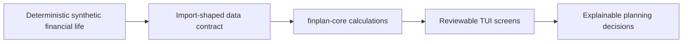

# Public demo plan

This document defines the public, synthetic showcase for `finplan-tui`. It is
intended to be useful to a person who discovers the project on GitHub, wants
to understand what it does, and wants to try it without a bank account,
brokerage account, database, cloud service, or secret.

## Product goal

The public demo should make a complete planning loop understandable:



The demo is not a fake version of Ryan's application. It is a small but
credible example household with enough data to exercise the public contracts:
cashflow, accounts, tax lots, charitable-gift analysis, location ranking,
portfolio projection, retirement scenarios, and backtesting boundaries.

For people who want to use the project with their own finances, SimpleFIN
Bridge is the recommended first provider in the documentation. It is the
provider path the maintainers can actually walk through and support. The
application boundary remains provider-neutral so users can later replace
SimpleFIN with Plaid, an institution export, or another provider without
changing the planning engine.

## Current state

The repositories currently provide:

- provider-neutral Go calculations in `finplan-core`;
- a public JSON CLI, including `taxlocation rank_states`;
- a Textual UI with dashboard, tax-lot, and location screens; and
- a small hard-coded synthetic repository.

The current UI is a scaffold, not yet the complete showcase. The private
finance TUI has substantially more screens, but it must not be copied into the
public repository with private data, database assumptions, or credentials.

## Target repository layout

```text
finplan-tui/
  demo/
    scenario.json          # versioned, human-readable canonical fixture
    README.md              # what the fictional household represents
    generate.py             # deterministic generator, fixed seed
    schema.json             # validation for the fixture contract
  screenshots/
    dashboard.svg
    cashflow.svg
    locations.svg
    lots.svg
    recurring.svg
    retirement.svg
    tour.svg
  scripts/
    capture_demo.py         # reproducible headless screenshots
    validate_demo.py        # fixture and route checks
  app.py
  repository.py
  core_adapter.py
  README.md
  QUICKSTART.md
  CONTRIBUTING.md
  SECURITY.md
```

The canonical fixture should be checked in. Generated data must be reproducible
from a named seed and schema version; it must not depend on the current clock,
network responses, machine hostname, or random state. A refresh can update the
fixture deliberately, but an ordinary demo run must not mutate it.

## Synthetic data contract

The fictional household should include:

- checking, savings, credit-card, brokerage, and retirement accounts;
- 12–24 months of categorized income, spending, transfers, and recurring bills;
- several securities with long- and short-term lots, gains, losses, and basis;
- an appreciated-stock charitable-gift scenario with carryforward potential;
- three locations with supplied state rules and median-home/property-tax priors;
- a retirement horizon with explicit spending, return, inflation, and withdrawal
  assumptions; and
- one intentionally incomplete input so the UI demonstrates uncertainty and
  requests for missing data.

Every synthetic person, employer, merchant, account number, symbol, address,
date, and dollar amount must be invented. Fixtures should include a prominent
`synthetic: true` marker and a human-readable `scenario_name`.

## Demo modes

The public command should have two deliberately distinct modes:

```sh
python app.py --demo
python app.py --static-demo
```

`--demo` is the live synthetic playground: it starts from a known scenario and
adds deterministic activity while the process remains open. `--static-demo`
freezes the same synthetic story for tests and screenshots. A future
`--fixture` mode can let developers try the same UI with a compatible file.
The recommended personal-data path is a separate SimpleFIN Bridge adapter
with credentials kept in a local protected config or secret store. Provider
and database adapters remain outside the public core.

## Screen sequence for a five-minute demo

The first-run experience should guide a person through this order:

1. **Dashboard** — balances, data freshness, and the fictional household's
   planning status.
2. **Cashflow** — income, spending, recurring transactions, and category
   drill-down.
3. **Tax lots** — basis, holding period, donation target, and core-selected
   lots for review.
4. **Locations** — ranked annual tax, assumptions, confidence, and reasons.
5. **Retirement** — scenario comparison and explicit open-data requirements.
6. **Simulation** — a clearly labeled illustrative projection, not a promise.

The first live slice currently includes the dashboard, tax lots, locations,
and cashflow screens. Retirement and simulation screens will be added against
the same evolving repository rather than receiving separate fixture logic.

Every screen should work with arrow keys, Enter, Escape, and the visible
contextual footer. A screen must never depend on a database worker merely to
render the demo fixture.

The `h` tour is deliberately built into the application. It is the first
orientation step for a GitHub visitor; real-data onboarding remains separate
and is documented around SimpleFIN Bridge.

## Setup standard

The README should get a new user from clone to screenshot in under five
minutes:

```sh
git clone https://github.com/sourcequench/finplan-tui.git
cd finplan-tui
python3 -m venv .venv
. .venv/bin/activate
python -m pip install -r requirements.txt
python -m finplan_tui --demo
```

The setup path should work offline after dependencies are installed. Go is
optional for the UI demo; when `finplan-core` is unavailable, the UI must show
that a calculation is unavailable rather than silently substituting a made-up
answer. The showcase CI job should build the core binary so screenshots
exercise the real public implementation.

## Screenshot and CI contract

Screenshots should be generated, not hand-edited:

```sh
python scripts/capture_demo.py --width 160 --height 45 --output screenshots
```

The capture script should:

- use the canonical fixture;
- visit every public route and at least one drill-down;
- wait for calculations to finish;
- fail on worker exceptions, error banners, missing widgets, or clipped
  required headings; and
- emit SVG first, with PNG conversion optional for GitHub display.

CI should run:

```sh
python scripts/validate_demo.py
pytest -q
ruff check .
python -m py_compile ...
```

The screenshot job should run at both a normal desktop size and a constrained
120×30 terminal size. Visual review remains human, but route coverage and
obvious rendering failures should be automated.

## Documentation sequence

The public README should lead with:

1. a one-paragraph TL;DR;
2. one screenshot or short GIF;
3. the five-minute quickstart;
4. a plain-language explanation of the data flow;
5. a Mermaid architecture diagram;
6. the list of calculations and their limitations; and
7. links to `QUICKSTART.md`, the data contract, adapter guide, and security
   policy.

The adapter guide should use SimpleFIN Bridge as the main end-to-end example:

1. create a SimpleFIN Bridge account and connect institutions;
2. configure the local adapter without putting the access token in Git,
   `.bashrc`, screenshots, or issue reports;
3. run an explicit sync and inspect imported account and transaction counts;
4. map provider accounts and categories into the public data contract; and
5. review provenance, dates, units, uncertainty, and results before acting.

It should then show how to replace SimpleFIN with CSV or JSON exports and
explain that Plaid or another aggregator belongs behind the same adapter
boundary. The public repository must not require a SimpleFIN credential for
the synthetic demo or for core tests.

## Privacy and maintenance gates

Before every public release:

- scan source, fixtures, screenshots, and Git history for personal data;
- assert all demo fixture values are synthetic;
- verify no PostgreSQL, Kubernetes, brokerage, email, filesystem-home, or
  secret references enter the public package;
- run the full demo route audit;
- rebuild screenshots from the fixture; and
- run the core and Python quality gates.

The fixture schema and demo route audit are the important maintenance anchors.
They let the UI evolve without allowing the demo to quietly become stale or
collapse when a new core operation is added.

## Implementation phases

1. Replace the three hard-coded repository tuples with a versioned canonical
   fixture and deterministic generator.
2. Add a documented SimpleFIN Bridge adapter package or companion example,
   with local-only credential handling, explicit sync behavior, and fixture
   normalization tests.
3. Expand the public models and repository contract for transactions,
   recurring items, scenarios, and retirement inputs.
4. Add the core-backed location ranking and lot-selection screens to the public
   TUI.
5. Add cashflow, retirement, and simulation screens using synthetic data only.
6. Add fixture validation, route smoke tests, screenshot capture, and CI.
7. Rewrite the README around the five-minute demo and publish generated
   screenshots.

The private finance application may consume the public packages, but its
database adapters, personal scenarios, live tax imports, and provider
credentials remain outside this repository.
