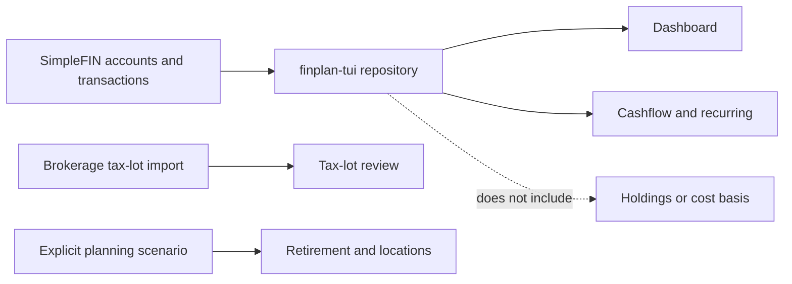

# Quickstart: run finplan-tui with your own data

The shortest safe path is SimpleFIN Bridge for accounts and transactions. The
application keeps the provider credential in a local protected file and reads
it when the TUI starts. It does not commit, print, or upload that credential.

## Synthetic demo

```sh
python3 -m venv .venv
. .venv/bin/activate
pip install -r requirements.txt
python app.py --demo
```

Press `h` for the tour. Use `q` to quit. The demo is synthetic and requires no
financial account.

## Docker

```sh
docker compose build
docker compose run --rm finplan --demo
```

The Compose volume is only for the local SimpleFIN credential described below;
the public repository contains no personal data.

## Connect SimpleFIN

1. Create a Setup Token at [`bridge.simplefin.org/simplefin/create`](https://bridge.simplefin.org/simplefin/create).
2. Connect the institutions you want and copy the one-time Setup Token.
3. From the repository root, run the helper. It claims the token and saves only
   the resulting Access URL:

   ```sh
   python3 scripts/simplefin_setup.py
   ```

4. Start the personal-data TUI:

   ```sh
   python app.py --simplefin
   ```

For Docker, the credential stays in the named Compose volume:

```sh
docker compose run --rm --entrypoint python finplan scripts/simplefin_setup.py
docker compose run --rm finplan --simplefin
```

The helper defaults to `~/.config/finplan-tui/simplefin-access-url` on the host,
or `/home/finplan/.config/finplan-tui/simplefin-access-url` inside the container.
It creates the directory with mode `700` and the file with mode `600`. Treat the
Access URL like a password: do not commit it, paste it into an issue, or put it
in shell history. If exposed, revoke or replace it through SimpleFIN.

SimpleFIN is designed for periodic updates rather than a high-frequency stream.
This application fetches on launch. The official guidance recommends no more
than 24 requests per day and an overlapping transaction window; see the
[developer guide](https://beta-bridge.simplefin.org/info/developers) and
[protocol](https://www.simplefin.org/protocol-v1.html).

## What the personal connection provides



SimpleFIN supplies account names, balances, transaction dates, payees, and
amounts. It does not provide holdings or cost basis, and this application does
not invent retirement assumptions, tax rules, property values, or residency.
Tax-lot analysis therefore needs a separate brokerage adapter; retirement and
state comparisons need an explicit scenario.

## Troubleshooting

- Missing access file: run the setup helper or pass `--simplefin-access-file`.
- Unsafe permissions: use `chmod 700` on the parent and `chmod 600` on the file.
- A Setup Token can be claimed only once; create a new one if claiming fails.
- If SimpleFIN reports an institution error, resolve it in Bridge and retry.
- Do not use stale provider data for a trading, tax, or charitable-gift decision.

## Building another adapter

Implement `PlanningRepository.load_planning_data()` and return the models in
`models.py`. Keep provider credentials and transformations inside that adapter;
do not add provider SDKs or personal defaults to the screens.
