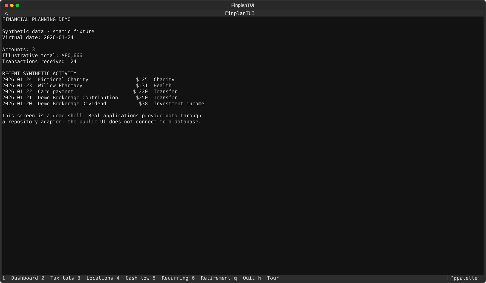
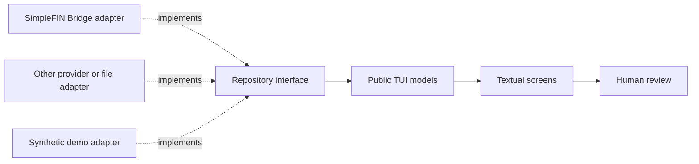

# finplan-tui

A small, provider-neutral Textual interface for financial-planning data.

Status: early public demo and UI boundary. It is not the private finance
application and does not yet provide a complete household planning workflow.



This is the public UI layer under extraction from the private finance
application. It deliberately contains no PostgreSQL, Kubernetes, brokerage
credentials, provider imports, household defaults, or personal data.

## Try the demo

```sh
python3 -m venv .venv
. .venv/bin/activate
pip install -r requirements.txt
python app.py --demo
```

The demo uses synthetic accounts, investment lots, locations, and a live
deterministic activity stream. While it is open, new transactions arrive and
balances change on a virtual clock. It is safe to run after cloning the
repository. Press `1` for the dashboard, `2` for tax lots, `3` for location
scenarios, `4` for cashflow, `5` for recurring activity, `6` for retirement,
`h` for the built-in tour, and `q` to quit. Use
`python app.py --static-demo` for a frozen fixture suitable for screenshots
and tests. The synthetic assumptions live in `demo/scenario.json` and can be
overridden with `--scenario path/to/scenario.json`.

## Boundary

The public UI consumes a small application-neutral data contract. A private
application can later provide PostgreSQL-backed repositories; other users can
provide files, APIs, or their own repositories.

The reusable Python package is `finplan_tui`. Install it locally when another
application needs the shared models and contracts:

```sh
pip install -e .
```

The private application uses `DashboardData`, `OperationalRepository`, and
their normalized models from this package while its existing screens migrate
incrementally. Its PostgreSQL adapter remains private; only normalized models
and provider-neutral contracts are shared.



This project is a planning and review UI, not a tax-filing system, broker, or
trading application.

For a real personal-data setup, the recommended path is SimpleFIN Bridge: it
provides the account and transaction feed used by the maintainers and can be
walked through end to end. The public demo itself remains fully synthetic and
requires no SimpleFIN credential. Plaid, CSV exports, and other providers can
implement the same repository boundary later.

## Use your own data

The maintained personal-data path is documented in
[`QUICKSTART.md`](QUICKSTART.md). It supports a local Python install or a
Docker/Compose setup and uses SimpleFIN Bridge for account and transaction
data. SimpleFIN does not provide brokerage tax lots or cost basis, so those
remain a separate adapter and are never guessed by the UI.

## Public demo roadmap

The current `--demo` mode is a safe synthetic scaffold. The maintained plan
for turning it into a complete, screenshot-ready showcase is in
[`DEMO_PLAN.md`](DEMO_PLAN.md). It covers deterministic fixtures, core-backed
calculations, route audits, reproducible screenshots, and the adapter guide
for building a personal data repository without sharing it.

## Development checks

```sh
pip install -r requirements-dev.txt
ruff check .
python -m py_compile app.py models.py repository.py
pytest -q
```

The public project should continue to pass these checks without a database,
cluster, provider account, or secret.
