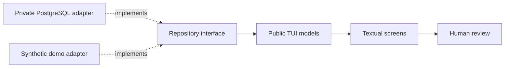

# finplan-tui

A small, provider-neutral Textual interface for financial-planning data.

Status: early public demo and UI boundary. It is not the private finance
application and does not yet provide a complete household planning workflow.

This is the public UI layer under extraction from the private finance
application. It deliberately contains no PostgreSQL, Kubernetes, brokerage
credentials, provider imports, household defaults, or personal data.

## Try the demo

```sh
python3 -m venv .venv
. .venv/bin/activate
pip install -r requirements.txt
python app.py --demo
```

The demo uses synthetic accounts, investment lots, and locations. It is safe
to run after cloning the repository. Press `1` for the dashboard, `2` for tax
lots, `3` for location scenarios, and `q` to quit.

## Boundary

The public UI consumes a small application-neutral data contract. A private
application can later provide PostgreSQL-backed repositories; other users can
provide files, APIs, or their own repositories.



This project is a planning and review UI, not a tax-filing system, broker, or
trading application.

## Development checks

```sh
pip install -r requirements-dev.txt
ruff check .
python -m py_compile app.py models.py repository.py
pytest -q
```

The public project should continue to pass these checks without a database,
cluster, provider account, or secret.
